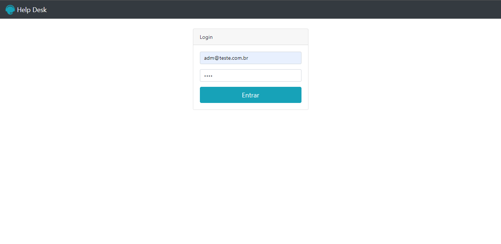
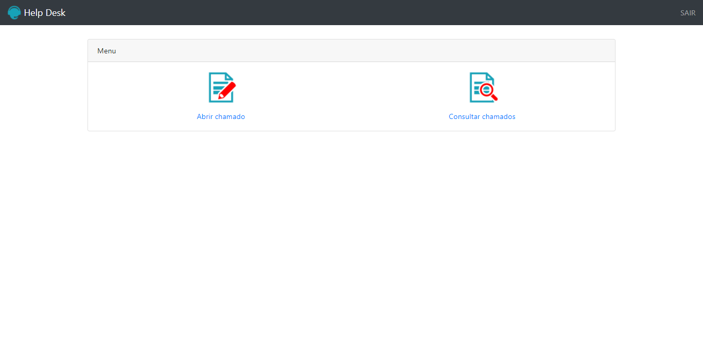
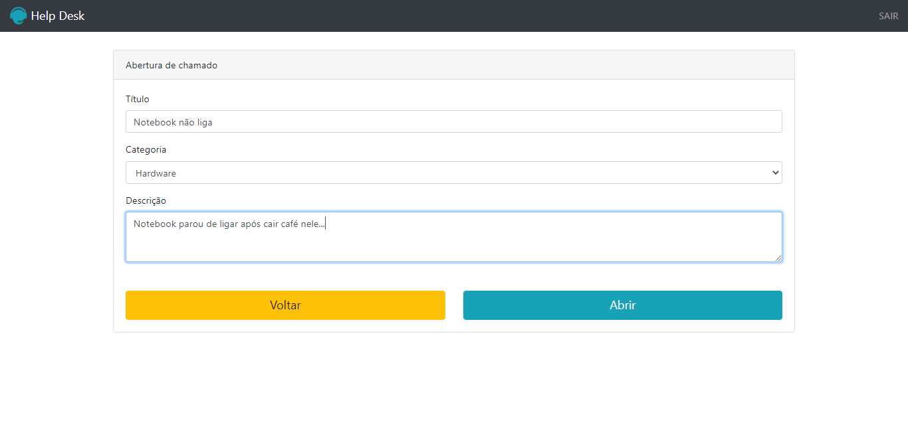
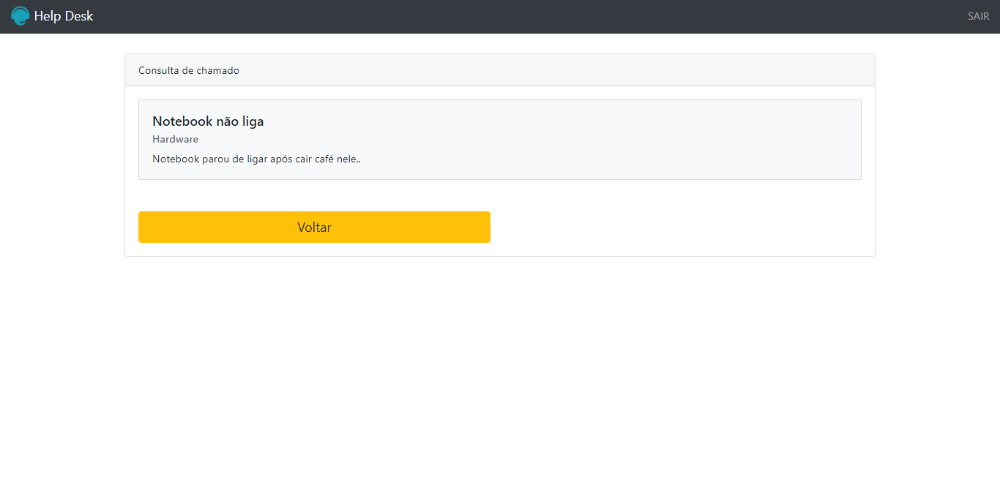

<h1 align="center">📞🎧</h1>
<h1 align="center">Help desk</h1>
<h1 align="center"></h1> 

<hr>

### 📚 Sobre

Help Desk é uma aplicação web PHP desenvolvida no módulo de PHP7 no curso de [Desenvolvimento Web](https://www.udemy.com/course/web-completo/), esta aplicação consiste em fazer login/logoff, abrir um chamado referente a um problema sobre: impressora, hardware, software ou rede e fazer a consulta dos chamados abertos.

Como a aplicação está atuando com php puro, e não possui um banco de dados para recuperar os usuários cadastrados, no arquivo 'public/valida_login.php' na linha 18, está um array que contêm os 4 usuários para teste, com um pequeno sistema de atribuição de cargo - Administrador e Usuário, a diferença entre os dois é que o cargo de Administrador pode visualizar todos os chamados de todos os usuários, enquanto quem contêm o cargo de Usuário pode visualizar apenas seus próprios chamados.

### 🎨 Detalhe

Implementando um pouco aplicação utilizei a função nativa php de reaproveitamento de código 'include', que reaproveita o menu de index.php e outras páginas reduzindo a quantidade de código html.

<hr>

### 🔥 Como contribuir

1. Fork este repositório;
2. Crie uma branch com sua feature: ** `git checkout -b my-feature` **;
3. Faça commit de suas mudanças: ** `git commit -m 'feat: My new feature'` **;
4. Envie para a branch: ** `git push origin my-feature` **.

Depois de fazer o 'merge' de seu pull request, você pode excluir seu branch.

### 💻 Tecnologias utilizadas

- [HTML](https://www.w3schools.com/html/)
- [CSS](https://www.w3schools.com/css/)
- [Bootstrap](https://getbootstrap.com/)
- [PHP](https://www.php.net/)

### ✈️ Como acessar o Aplicativo 

```
# Clone o repositório
$ git clone https://github.com/GilbertoASJ/Help-desk.git

# Acesse
$ cd Help-desk

# Instale as dependências
- Xampp

# Rode o projeto
- Mova a pasta para o diretório publico do apache htdocs
- Inicie o apache no Xampp

# Acesse o Help desk <http://localhost/Help-desk/public>
```

### 🖼️ Imagens

<p align="center"></p> <hr>
<p align="center"></p> <hr>
<p align="center"></p> <hr>
<p align="center"></p> <hr>

### 📃 Licença

Este projeto está sobre a licença <a href="https://github.com/GilbertoASJ/Help-desk/blob/main/LICENSE">MIT</a>